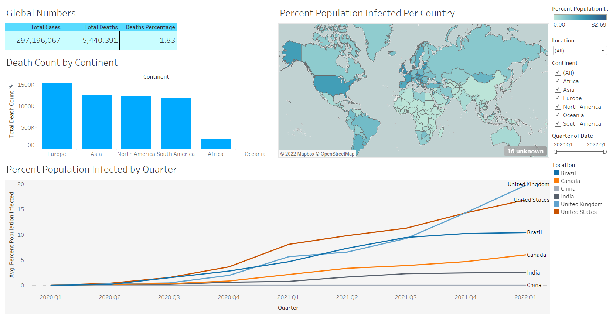

# Pranav Joshi Portfolio

## My data science portfolio

## [Project 1: Term Deposit Subscription Classifier](https://github.com/pranavjoshi-hub/term-deposit-subscription-classifier.git)
* Cleaned the data.    
* Performed exploratory data analysis and some feature engineering.  
* Optimized Logistic Regression & K-Nearest Neighbours using GridSearchCV to reach the best model.  
* Built a classification model to predict whether or not clients will subscribe to a term deposit facilitated by a banking institution.  

## [Project 2: COVID-19 Data Exploration & Dashboard](https://github.com/pranavjoshi-hub/covid19-data-exploration-and-dashboard.git)
* Split the dataset into 2 parts along the column axis, one dataset for deaths and the other for vaccinations.
* Explored a COVID-19 dataset containing 152,463 records, using SQL.
* Pulled relevant data for dashboard using SQL again.
* Created a COVID-19 dashboard using Tableau.
* Data was last updated on January 5, 2022.

## [Project 3: Consumer Review Sentiment Analysis for Fast Food Chains](https://github.com/pranavjoshi-hub/fast-food-chain-reviews.git)
* Scraped consumer reviews for Subway, McDonald's and Burger King.
* Cleaned and feature engineered the data.
* Conducted sentiment analysis on the prepared consumer review data.
* Stored the data in a remote MongoDB database.
* Built a sentiment analysis dashboard.

## [Project 4: COVID-19 Dashboard](https://github.com/pranavjoshi-hub/covid19-dashboard.git)
* Built a COVID-19 dashboard using Power BI.
* Dashboard displays updated worldwide statistics for COVID-19.
* Data was last updated on April 2, 2021.

